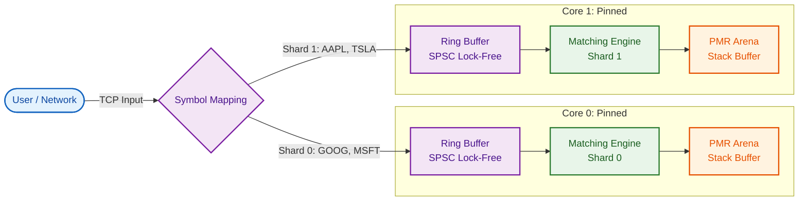

# High-Performance Order Matching Engine

A production-grade, high-frequency trading (HFT) Limit Order Book (LOB) and Matching Engine written in C++20. Designed for extreme throughput, deterministic latency, and cache efficiency using modern lock-free techniques.

> **Performance Benchmark**: **~156,000,000 orders/second** (Average) | **~169,000,000** (Peak) on Apple M1 Pro.

### ⚡️ Key Takeaways
*   **Architecture**: Sharded "Share-by-Communicating" design avoids global locks.
*   **Memory**: `std::pmr` monotonic buffers on the stack = 0 heap allocations on hot path.
*   **Optimization**: `alignas(128)` (vs 64) reduced M1/M2 false sharing by ~5%.

---

## 🚀 Key Features

*   **Ultra-High Throughput**: Capable of processing **>150 million** distinct order operations per second.
*   **Zero-Allocation Hot Path**:
    *   **PMR (Polymorphic Memory Resources)**: Uses `std::pmr::monotonic_buffer_resource` with a pre-allocated 512MB stack buffer for nanosecond-level allocations.
    *   **Soft Limits**: Gracefully falls back to heap allocation if the static buffer is exhausted (no crashes).
*   **Lock-Free Architecture**:
    *   **SPSC Ring Buffer**: Custom cache-line aligned (`alignas(64)`) ring buffer for thread-safe, lock-free communication between producer and consumer.
    *   **Shard-per-Core**: "Share by Communicating" design. Each CPU core owns a dedicated shard, eliminating mutex contention entirely.
*   **Cache Optimizations**:
    *   **Flat OrderBook**: Replaces node-based maps with `std::vector` for linear memory access.
    *   **Bitset Scanning**: Uses CPU intrinsics (`__builtin_ctzll`) to "teleport" to the next active price level, skipping empty levels instantly.
    *   **Compact Storage**: Order objects are PODs (Plain Old Data) optimized for `memcpy`.
*   **Verification & Safety**:
    *   **Deterministic**: `--verify` mode runs a mathematically verifiable sequence (Matches == Min(Buys, Sells)).
    *   **Instrumentation**: `--latency` mode enables wall-clock end-to-end latency tracking.

---

## 🏗 Architecture

The system moves away from the traditional "Central Limit Order Book with Global Lock" to a **Partitioned/Sharded Model**.



1.  **Ingestion (Exchange)**:
    *   Orders are received and hashed by `SymbolID`.
    *   "Smart Gateway" logic routes the order to the specific Shard owning that symbol.
2.  **Transport (Ring Buffer)**:
    *   Orders are pushed into a lock-free Single-Producer Single-Consumer (SPSC) ring buffer.
    *   This acts as the boundary between the "Network/Producer" thread and the "Matching/Consumer" thread.
3.  **Matching (Core)**:
    *   **Flat OrderBook**: Bids and Asks are simple `std::pmr::vector`s indexed directly by price (O(1) lookup).
    *   **Matcher**: Iterates linearly over the vector for maximum hardware prefetching efficiency. Active orders are tracked via a `Bitset`.
4.  **Memory Management**:
    *   A Monotonic Buffer (Arena) provides memory for new orders. It resets instantly (`release()`) between benchmark runs, preventing fragmentation.

---

## 🛠 Build & Run

### Prerequisites
*   C++20 Compiler (GCC 10+ / Clang 12+)
*   CMake 3.14+

### Compiling
```bash
mkdir -p build && cd build
cmake .. -DCMAKE_BUILD_TYPE=Release -DCMAKE_CXX_FLAGS="-march=native"
make -j$(nproc)
```

### Running Benchmarks
To replicate the >150M ops/s performance:
```bash
./build/src/benchmark
```

To measure **End-to-End Latency** (approximate P50/P99):
```bash
./build/src/benchmark --latency
```
*Note: Latency mode adds instrumentation overhead and runs usually at ~30-40M ops/sec.*

### Running Verification
To ensure the engine is actually matching correctly and not just dropping frames:
```bash
./build/src/benchmark --verify
```

### Real-World Market Replay
Test the engine against **live Binance L3 data** (Trade + Depth updates) to verify handling of realistic price clustering and bursty order flow.

1. **Record Data** (Requires Python 3 + `websocket-client`):
   ```bash
   # Record 60 seconds of live BTCUSDT data
   python3 scripts/record_l3_data.py 60
   ```

2. **Run Replay**:
   ```bash
   ./build/src/benchmark --replay data/market_data.csv
   ```
   > **Result**: ~132,000,000 orders/sec (M1 Pro) on real-world data.

### Running the Server
Start the engine networking layer (listens on port 8080):
```bash
./build/src/OrderMatchingEngine
```

**Populate the Book (Optional):**
To quickly seed the book with Bids, Asks, and Trades for testing/visualization:
```bash
python3 scripts/seed_orders.py
```

---

## 📊 Client Usage (TCP)

Connect using `netcat` or any TCP client.

**Submit Order:**
```text
BUY AAPL 100 15000
> ORDER_ACCEPTED_ASYNC 1
```
*(Format: SIDE SYMBOL QTY PRICE_INT)*

**Subscribe to Market Data:**
```text
SUBSCRIBE AAPL
> SUBSCRIBED AAPL
> TRADE AAPL 15000 50
```

---

## 🧪 Testing

The project includes a comprehensive GoogleTest suite covering matching logic, cancellation scenarios, and partial fills.

```bash
./build/tests/unit_tests
```

## 📈 Roadmap (Future)
*   **Kernel Bypass**: Integration with DPDK/Solarflare for sub-microsecond wire latency.
*   **Batching**: Processing orders in cache-line sized batches (e.g., 8 orders) to amortize ring buffer costs.
*   **Market Data Distribution**: Multicast UDP feed for quote dissemination.
